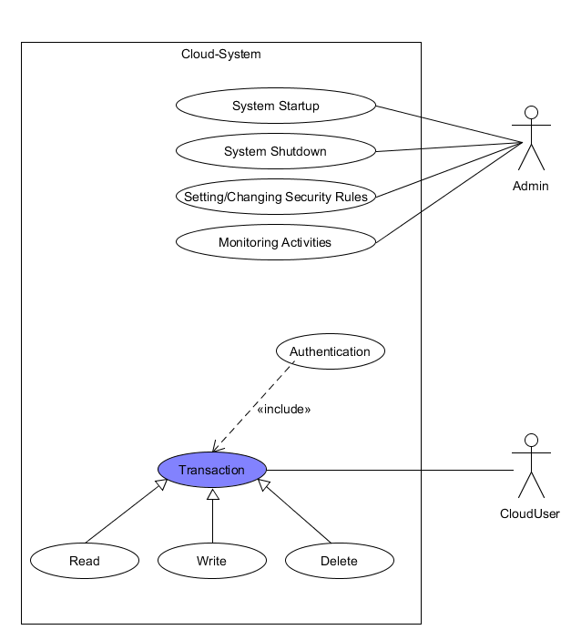
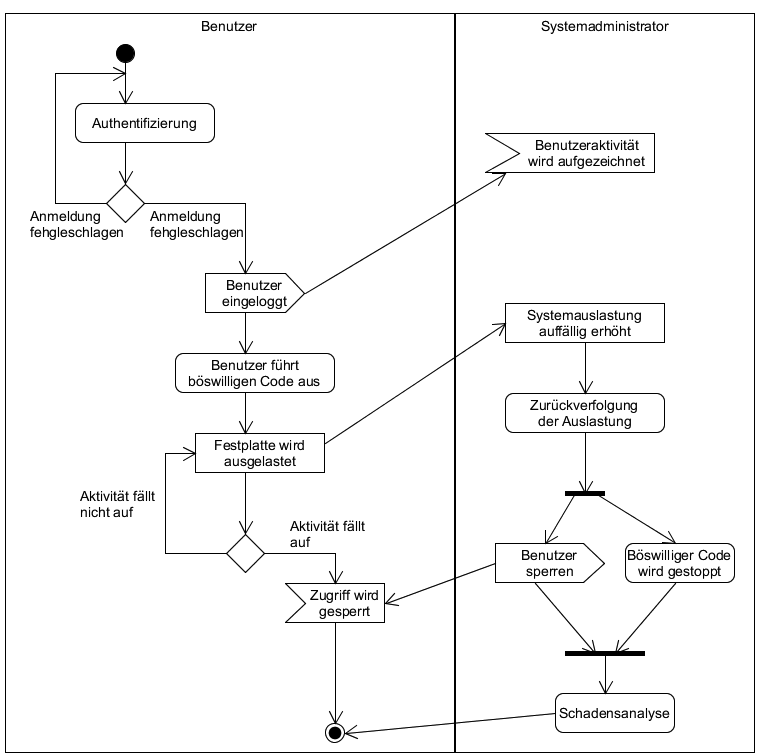

# Pflichtenheft - Cloud Security
## von Philipp Viertel und André Kaleja

### 1. Einführung

Im Rahmen der Veranstaltung "spezielle Gebiete des Softwareengineering" im SS 2017 wird eine Projektarbeit zum Thema Cloud Security erstellt. Da Clouds in Zukunft eine immer wichtigere Rolle in der IT spielen werden, ist es notwendig sich mit der Sicherheit dieser neuen Systeme stärker auseinanderzusetzen.

### 2. Zielsetzung

Das Ziel des Projekts beinhaltet das Aufsetzen einer lauffähigen Cloud zum Durchspielen von bestimmten Angriffsszenarien, das Ausnutzen von Sicherheitslücken und Betrachtung von entsprechenden Gegenmaßnahmen. Zwei wichtige Begriffe dabei sind Datenschutz (Privacy) und Datensicherheit.

Aufgrund des Umfangs des Themas und der vielen unterschiedlichen Lösungen, Produkten und Strategien im Cloud-Sektor, ist es schwierig über eine einzige Cloud-Security zu sprechen. Der Fokus liegt daher auf einem konkreten Beispielszenario, welches die Sicherheit eines bestimmten Cloud-Systems testet. Was für eine Cloud-Lösung ein Problem darstellt, kann ebenso gut für ein anderes System gar keine Schwierigkeit sein. Es gibt generelle Probleme die für alle Systeme gelten (z.B. DoS (Denial-of-Service) Attacken), jedoch beinhalten unterschiedliche Systeme auch unterschiedliche Sicherheitsstrategien.

### 3. Verwendete Technologien

Mögliche Cloudlösungen wie z.B. ownCloud, OpenStack, Abiquo und CloudStack stehen zur Verfügung. Für das Projekt werden wir OpenStack verwenden, da ein Linux-orientiertes System von uns bevorzugt wird. Es bietet auch eine gute Unterstützung für virtuelle Systeme.

* Cloudlösung: OpenStack mit DevStack
* Host-Rechner: Virtuelle Maschine mit Ubuntu 16.04.2 LTS 64-Bit über Oracle VirtualBox
* Die Datenbank CVE (Common Vulnerabilities and Exposures) wird zur Definition und Auffindung von Sicherheitslücken verwendet

### 4. Verantwortlichkeiten

#### Philipp Viertel

* Aufsetzen einer virtuellen Linux Maschine sowie Einrichtung eines lauffähigen Cloud-Dienstes auf dem Host-Rechner
* Konfiguration, Steuerung und Überwachung der Cloud und ihrer Sicherheitsmechanismen
* Dokumentation

#### André Kaleja

* Sichtung und Erstellung passender Angriffsszenarien
* Testen und dokumentieren von Angriffen und Sicherheitslücken
* Steuerung und Überwachung der Cloud und ihrer Sicherheitsmechanismen

### 5. Use Case Diagramme

#### Cloud-System
Abbildung 1: Use-Case Diagramm des Cloud-Systems mit den wichtigsten Aktivitäten und Akteuren.

#### DoS Attacke
Abbildung 2: Beispielhaftes Use-Case Diagramm für eine DoS Attacke. Der Attacker operiert als Benutzer, da er normal im System angemeldet ist, jedoch schadhaften Code ausführt.

### 6. Aktivitätendiagramm
Abbildung 3: Aktivitätendiagramm für eine beispielhafte DoS Attacke. Die Gegenmaßnahmen sind stark abhängig von der verwendeten Cloud-Technologie, daher sind die Maßnahmen bzw. Aktivitäten abstrakt gehalten.

### 7. User Stories

* Benutzer
	* Benutzer möchte Daten auf der Cloud ablegen, um sie sicher und konsistent verwaltet zu wissen
	* Benutzer möchte jederzeit von überall auf die Daten zugreifen können, um flexibel mit den Daten zu arbeiten
	* Benutzer möchte seine Daten geschützt wissen, um die Privatsphäre und Integrität zu wahren

* Angreifer
	* Angreifer möchte Zugriff auf die Cloud bekommen, um Daten einzusehen oder zu manipulieren
	* Angreifer möchte die Cloud-Funktionalitäten beeinträchtigen, um Schaden zu verursachen
	* Angreifer möchte einen ordnungsgemäßen Zugriff vortäuschen, um einen andersartigen Angriff zu verbergen

* Systemadministrator
	* Systemadministrator setzt Sicherheitsregeln fest, um Datensicherheit und -schutz zu gewährleisten
	* Systemadministrator überwacht Cloud-Aktivitäten, um Auffälligkeiten frühzeitig zu erkennen
	* Systemadministrator verändert Rechte und Einstellungen, um auf Angriffe und Täuschungen zu reagieren

### 8. Projektplan

* 29.05 - 04.06
	* Philipp: Aufsetzen der VM mit lauffähiger Cloud
	* André: Sichtung von relevanten Sicherheitslücken und Möglichkeiten
* 05.06 - 25.06
	* Philipp & André: Durchführung von Angriffen, Testen und Dokumentation
* 26.05 - 02.07
	* Philipp & André: Analyse von Abwehrmaßnahmen, Testen und Dokumentation
* 03.07 - 10.07
	* Freier Puffer (Zusammenführung, Korrekturen, Fertigstellung)

